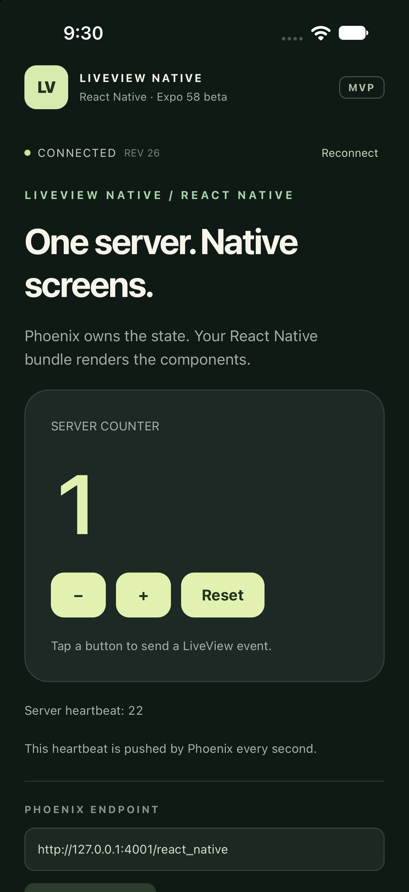
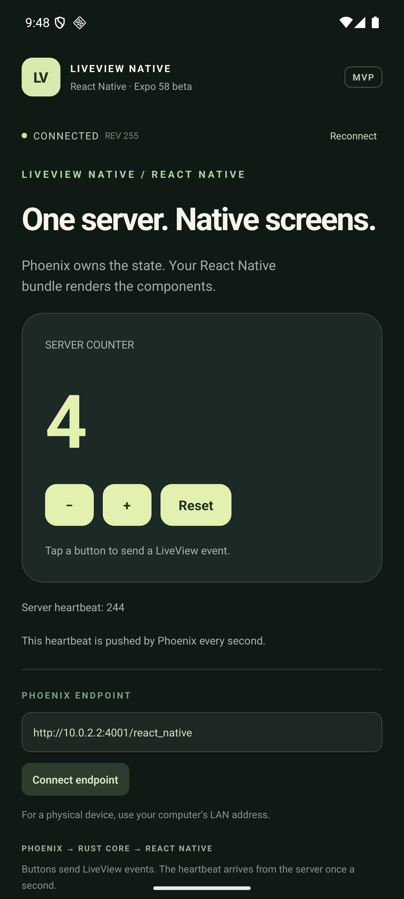

# LiveView Native for React Native — Expo 58 MVP

An installed React Native bundle renders a Phoenix LiveView through the fork's
Rust core. The Expo native module wraps UniFFI on iOS and Android. Rust performs
the HTTP bootstrap, Phoenix channel join, event calls, and LiveView diff merges;
JavaScript validates and renders atomic document snapshots.

The example uses Expo **58.0.1** (the SDK 58 beta channel checked on 2026-10-01),
React **19.3.0**, and React Native **0.88.0-rc.3**. It needs a custom native build.
Expo Go does not contain this module.

## Run the example

Prerequisites: Node 22.13+ on the supported even release lines, Python 3, Rust/Cargo,
Elixir/Erlang, and Xcode/CocoaPods or Android SDK/NDK/JDK. The iOS script produces
Apple Silicon simulator and iOS device slices. Android needs an NDK; the script
defaults to `27.1.12297006` and accepts `ANDROID_NDK_HOME`.

Start Phoenix from the repository root in one terminal:

```sh
cd tests/support/test_server
mix deps.get
mix phx.server
```

The server listens on port 4001. On a Homebrew installation, ensure Erlang's
`bin` directory is on PATH if `mix` reports that `erl` is missing.

Build the native core from this fork before the first app build:

```sh
cd crates/core/liveview-native-core-react-native
npm ci
rustup target add aarch64-apple-ios-sim aarch64-apple-ios
npm run build:ios
cd example
npm ci
npm run ios
```

For Android, use the same package and example directories:

```sh
cd crates/core/liveview-native-core-react-native
npm ci
npm run build:android
cd example
npm ci
npm run android
```

`build:android` builds ARM64 and x86_64 by default. To build just one ABI quickly,
run `PROFILE=dev npm run build:android -- arm64-v8a`. Generated bindings, libraries,
prebuilt app directories, and node_modules are ignored; regenerate them after
changing Rust. Both bindings and libraries must come from the same core source.

The default endpoint is `http://127.0.0.1:4001/react_native` on the iOS simulator
and `http://10.0.2.2:4001/react_native` on the Android emulator. For a physical
device, enter your computer's reachable LAN address in the app and configure
Phoenix to listen on that interface. The example's HTTP/cleartext settings are
development settings.

Tap +, −, and Reset. The count is owned by Phoenix. The heartbeat is a separate
server push every second, demonstrating updates without a button press. The
screen exposes connection state, document revision, and reconnect controls.

## Expo Modules 2.0 and build process

The iOS bridge uses `@ExpoModule("LiveViewNative")`, `@JS(.concurrent)` async
methods, `@Record`, and an explicitly named `@Event("onUpdate")`. The public
React API and native event payload remain the same. Payload conversion and Rust
shutdown run away from the JavaScript thread; Expo owns the promise and event
bindings. The exact macro surface was checked against the installed
`expo-modules-core@58.0.10`, then compiled and exercised in the example.

Android uses the SDK's `expoModule { v2 true }` compiler integration and
`@ExpoModule`, suspend `@JS` methods, and an explicitly named `@Event`.
Its registry is `expoV2.modules`, so the JS lookup selects that host on Android
and preserves the existing iOS lookup. Compiler discovery replaces Android's
legacy module list. Final listener removal/runtime teardown closes active
sessions, with Rust work on the IO dispatcher. The TypeScript hook and renderer
keep the same transport contract on both platforms.

The architecture is:

```text
Phoenix LiveView ↔ Rust core ↔ UniFFI ↔ Expo native module ↔ useLiveView ↔ RN components
```

Modules 2.0 changes the native bridge. It does not replace the React Native
renderer, merge LiveView diffs, or compile Elixir into the app. Our snapshots
still go through validation, React reconciliation, and the normal native view
pipeline. Reducing bridge overhead may help frequent updates, but this example
has no measured rendering or frame-rate improvement.

Expo's [early look](https://expo.dev/blog/an-early-look-at-expo-modules-2-0)
reports faster synchronous calls in release microbenchmarks. Our exported methods
are asynchronous and include network/Rust work, so those multipliers are not an
app speedup claim. Typed declarations improve compiler feedback and reduce
handwritten binding definitions. Generated TypeScript and native-view authoring
should only be adopted once the installed beta supports the required contract.

The newer [SDK 58 beta changelog](https://expo.dev/changelog/sdk-58-beta) also
announces Android 2.0, precompiled Android core libraries, and continued iOS
precompiled framework support. These are separate from the annotation API.
This example already links precompiled Expo/React Native frameworks on iOS.
The installed Android beta rejects its bundled precompiled core libraries
because its source checksum does not match; Gradle correctly falls back to
source compilation. We keep that compatibility check intact. CocoaPods remains
the supported example pipeline; switching to the experimental SwiftPM path
would add another integration change without a measured benefit here.

Both native-core build scripts always let Cargo check sources, dependencies,
configuration, and toolchain with `--locked`. UniFFI generates into a temporary
directory, then only changed bindings are copied. Android libraries copy only
when bytes change. iOS reuses the XCFramework when compiled libraries, headers,
profile, and packaged contents still match. Changed or missing artifacts are
repaired. This preserves compiler inputs on a repeat build and avoids needless
Swift/Kotlin recompilation.

Warm measurements on this development machine: **2.357 s** for the iOS core
script and **2.531 s** for Android `PROFILE=dev arm64-v8a`, with generated/native
artifact modification times unchanged. These measure the scripts with existing
Cargo outputs, not clean app compilation. A warm unchanged iOS app build with
existing DerivedData took 19.328 s. See [measurement evidence](docs/build-times.json).

Use `PROFILE=release npm run build:ios` for optimized Rust device/simulator
libraries, or the default `dev` for iteration. Release app builds remain
unverified. `LVN_FORCE_REBUILD=1 npm run build:ios` forces XCFramework packaging.
Preserve Cargo `target/`, Xcode DerivedData, and Gradle caches between builds;
avoid `prebuild --clean` during normal development. React component changes use
Metro/Fast Refresh; server template/state changes require no native build.
Swift/Kotlin changes rebuild the native app, and Rust changes require the core
script followed by that native app build.

## Use the package

```tsx
import { LiveView, useLiveView } from '@liveview-native/react-native';

function Screen() {
  const session = useLiveView({ url: 'https://your-server/react_native' });
  return <LiveView session={session} />;
}
```

The built-in component vocabulary is `View`, `Text`, and `Pressable`. Phoenix
emits NEEx markup using the `react_native` format. `phx-click` maps a press to a
LiveView event; `phx-value-*` attributes become event payload fields. `id` maps to
React Native `testID`. The MVP uses a small installed style-token vocabulary in
`data-style`, rather than downloading styles or executable JavaScript.

Pass a `components` registry to `LiveView` to render additional components
installed in the app bundle. A custom component receives the validated node,
attributes, children, and `pushEvent`; it is responsible for mapping attributes
to its own supported props. Server attributes are never spread into native
props automatically.

## Implementation boundary

- Core adds `Platform::ReactNative` and `Document.snapshot_json()`. A snapshot
  holds the document mutex once and returns an ordered, flat node table.
- Native `LiveViewNative` exposes `connect`, `sendEvent`, `disconnect`, and
  `onUpdate`. Session IDs and monotonically increasing revisions prevent late
  callbacks from changing a newer screen. Weak callbacks avoid ownership cycles.
- `useLiveView` subscribes through `useSyncExternalStore`. Backgrounding closes
  the session; foregrounding opens a fresh LiveView. The last rendered tree stays
  visible while disconnected, with built-in actions disabled. The demonstration
  counter resets because its assigns belong to the new server session.
- The renderer validates node references, tree shape, and attributes. It
  maps recognized tags to installed RN components using stable node keys scoped
  to each client session.

The checklist sample now includes durable versioned tasks, native secure-cookie
persistence, revocable demo authentication, document-generation keys, Expo Router
navigation, forms, uploads, SQLite cached reads/drafts, typed durable commands and telemetry. See the [milestone log](docs/checklist-progress.md) for
validation, screenshots and limitations. Incremental bridge delivery is the remaining implementation milestone.
Document changes currently use full snapshots. Custom components expose only
installed capabilities. This is a development example, not a published npm/Hex
release.

The example includes an idempotent Expo config plugin that sets Android's
`useDevSupport = BuildConfig.DEBUG`. Expo 58's template otherwise inherits the
debug-support default from the prebuilt React Native library, which can cause a
debug app to request an absent packaged JS bundle instead of Metro. The plugin
is scoped to this example and leaves release builds with debug support disabled.
Use the standard `expo start`/`expo run` LAN mode when connecting an Android
emulator; the beta's `--localhost` mode can bind only IPv6 localhost and refuse
the emulator's IPv4 `10.0.2.2` connection.

## Checklist app progression

See [delivery log](docs/checklist-progress.md) for the ordered checklist app milestones and verification evidence. The package now offers optional `setTelemetrySink` instrumentation; the example enables Expo Observe. [Parse baseline](docs/parse-baseline.json) measures Node document parsing only, not mobile frame performance.

## Verify

From the repository root, with Phoenix running:

```sh
cargo test --locked -p liveview-native-core --lib react_native_snapshot
cargo test --locked -p liveview-native-core --lib react_native_counter_round_trip -- --ignored
```

From `tests/support/test_server`:

```sh
mix test test/test_server_web/live/counter_live_test.exs
```

From this package and its example:

```sh
npm test
npm run test:build
npm run typecheck
cd example
npm run typecheck
npm run bundle
```

The Rust round-trip test checks the real native-format bootstrap, event replies,
merged counter snapshots, and unsolicited heartbeat diffs. JavaScript tests cover
malformed documents, event mapping, stale sessions/revisions, teardown, and
disconnected actions. Native app builds and UI checks verify the complete bridge.

Verified on 2026-10-01: 2 Rust snapshot tests, 1 actual Rust/Phoenix round-trip
test, 3 Phoenix tests, 12 JavaScript tests, 6 build-helper tests, both TypeScript checks, and Metro
Hermes export passed. Both Modules 2.0 native apps compiled and ran. iOS UI presses changed the
server counter 0 → 1, heartbeat updates arrived, and reconnect opened a fresh
session. On Android, React Native DevTools invoked the installed native
transport: a separate session changed 0 → 1, received a subsequent heartbeat,
and disconnected successfully. The running Android screen also reflected a
native event changing its existing counter 3 → 4. See the
[Android verification evidence](docs/android-native-verification.json).
The raw Qt emulator window was unavailable to desktop UI automation, so the
Android 2.0 event proof is programmatic. The earlier MVP's iOS foreground resume
and Android Reconnect were also verified. iOS ran on an Apple
Silicon iPhone 18 Pro / iOS 27 simulator; Android ran on a Pixel 8 Pro / API 36
ARM64 emulator. Physical devices and distribution builds have not been tested.

## Screenshots

Captured from the running custom development builds, connected to the actual
Phoenix demo. Tapping + changes the server counter and the heartbeat updates
without a press.

| iOS simulator | Android emulator |
| --- | --- |
|  |  |

The checklist sample now includes SQLite cached offline reads and process-persistent drafts. Cached data is labelled stale/authentication unverified; server actions require a connection until the command milestone. Use `npm run test:navigation` for the TS-aware example coordinator tests. See [milestone evidence](docs/checklist-offline-verification.json) and [delivery log](docs/checklist-progress.md).
